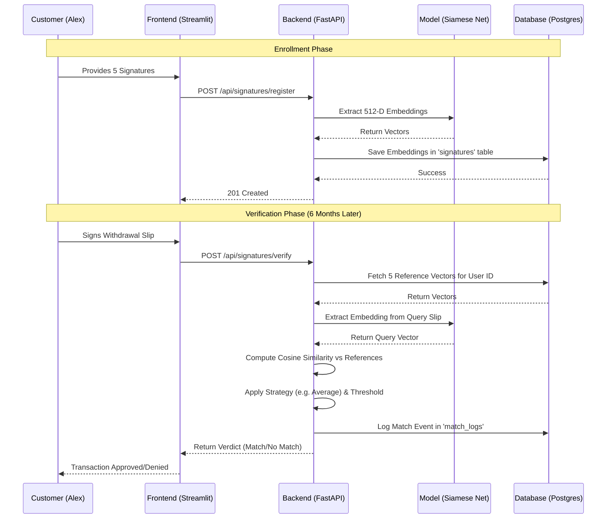

# Banking Customer Signature: End-to-End Flow

This document outlines the operational and technical flow for enrolling and verifying a banking customer's signature.

## Scenario: New Account Opening
**Customer**: Alex Maharjan  
**Action**: Visiting a bank branch to open a high-value savings account.


## System Architecture & Logic

### 1. Neural Network Architecture: Siamese Twin CNN
The system utilizes a **Siamese Neural Network** designed specifically for signature feature extraction.
- **Backbone**: A twin-branch Convolutional Neural Network (CNN).
- **Layers**: 4 Optimized ConvBlocks (Conv → BatchNorm → ReLU → MaxPool).
- **Head**: 2 Fully Connected (FC) layers with Dropout for higher precision.
- **Output**: 512-dimensional embedding vector representing the unique "DNA" of the signature.
- **L2 Normalization**: All vectors are projected onto a unit sphere, ensuring that "Similarity" is a pure angular measurement (Cosine Similarity).

### 2. The Verification Logic
When a query signature is compared against $N$ reference signatures, the system calculates $N$ separate similarity scores (ranging from -1.0 to 1.0).

| Strategy | Logic | Use Case |
| :--- | :--- | :--- |
| **Highest** | `max(scores)` | Standard convenience; if any one signature matches, it's Alex. |
| **Lowest** | `min(scores)` | High-security; the query must be consistent with *every* reference. |
| **Average** | `mean(scores)` | Balanced; reduces the impact of a single outlier reference. |

### 3. Thresholding
- **Threshold Value**: Typically set between 0.80 and 0.95.
- **Importance**: Acts as the "Guardrail". A higher threshold reduces False Positives (Imposters) but might increase False Negatives (Genuines with slight variation).


## Project Workflow: Sequence Diagram




## Phase 1: Enrollment (Registration)
*At the branch, the customer provides "Golden" reference signatures.*

### 1. Data Specification & Acquisition (The Foundation)
To achieve top-tier performance and provide valid data for future model training, we follow these rigorous collection standards:
- **Method**: Digital Signature Pad (e.g., Wacom/Topaz) or a 1:1 Flatbed Scanner.
- **Color Format**: **Grayscale** (8-bit, 0-255). We avoid RGB to reduce noise and B&W (Binarized) raw saves to preserve pressure.
- **Resolution**: Minimum **300 DPI**.
- **Pixels**: Raw capture should be at least **1024px width** to ensure fine strokes (micro-features) are captured without aliasing.
- **Background**: Pure white, non-textured background (to allow for clean mathematical subtraction).

### 2. Aggressive Preprocessing Pipeline
Every image received undergoes a multi-stage "Aggressive Preprocessing" logic to ensure the model sees only the core signature topology:
1.  **Contrast Enhancement (CLAHE)**: Uses *Contrast Limited Adaptive Histogram Equalization* to normalize ink intensity (making feathery strokes consistent).
2.  **Denoising**: A $5 \times 5$ Gaussian Blur is applied to remove electrical or scanner sensor noise.
3.  **Binarization (Inversion)**: Otsu's Adaptive Thresholding is used to separate ink (255) from paper (0).
4.  **Tight Cropping**: A bounding box is calculated with exactly **2px padding**. Any more padding distracts the CNN; any less might clip a stroke edge.
5.  **Aspect-Ratio Resize**: The signature is resized to fit a $128 \times 256$ window **while preserving its original ratio**. Empty space is zero-filled (padded) to prevent the "stretching" distortion that often causes False Positives.


## Phase 2: Transaction Verification
*Alex visits a branch to withdraw 10,000 cash.*

### 1. Input: Query Signature
- Alex signs the withdrawal slip.
- **System Settings**: 
    - **Threshold**: 0.90
    - **Strategy**: Average Similarity

### 2. Processing: Cross-Check
- The query vector is compared against the 5 "Golden" vectors.
- **Verdict Logic**: `Final Score = Mean(CosineSimilarities)`

### 3. Output: Final Verdict
- ** VERIFIED**: High similarity detected across the reference set.
- **Security Audit**: A record is saved in the `match_logs` table for compliance.


## Why this matters?
In a banking context, automated signature verification:
1. **Reduces Human Error**: Tellers can be fooled by skilled forgeries; the CNN looks at micro-features.
2. **Speed**: Instant validation across multiple branches.
3. **Auditability**: Every verification attempt is logged with a mathematical score, creating a clear audit trail for regulators.


## The AI Engine: siamese_cedar.pt

The core of the system is the **Siamese Neural Network (CNN)**. It doesn't "compare images" in the traditional sense; it transforms images into **Mathematical Signatures** (Embeddings).

### 1. What are the Model Weights (`siamese_cedar.pt`)?
The `.pt` file contains millions of pre-trained parameters (weights) that the model has learned by looking at thousands of genuine and forged signatures.
- **Feature Extraction**: These weights allow the model to automatically "know" which parts of a signature are important (e.g., the sharp turn of a 'M', the pressure of a loop) and which are irrelevant (e.g., slight paper texture).
- **Fixed Representation**: Once loaded, the model is **deterministic**. The same signature image will *always* result in the same 512-D vector.

### 2. The Embedding Lifecycle: Registration vs. Verification

```mermaid
graph TD
    subgraph "Phase 1: Registration"
        A[Signature Image] --> P1[Preprocessor]
        P1 --> M1["Siamese Model Inference<br/>(Uses siamese_cedar.pt)"]
        M1 --> V1[512-D Embedding Vector]
        V1 --> DB[(Database: 'signatures' table)]
    end

    subgraph "Phase 2: Verification"
        B[Query Signature Image] --> P2[Preprocessor]
        P2 --> M2["Siamese Model Inference<br/>(Uses siamese_cedar.pt)"]
        M2 --> V2[Query 512-D Vector]
        DB --> REF[Fetch Reference Vectors]
        V2 --> SIM[Calculate Cosine Similarity]
        REF --> SIM
        SIM --> STRAT[Apply Match Strategy<br/>(Avg/Min/Max)]
        STRAT --> VERD[Final Verdict: Match/No Match]
    end
```

### 3. Step-by-Step Technical Logic
1.  **Loading**: At startup, `ModelManager` loads `siamese_cedar.pt` into memory (CPU or GPU).
2.  **Inference (Extraction)**:
    - During **Registration**, the model converts each of your 5 uploads into 5 separate **Embeddings** (arrays of 512 numbers). Only these numbers are saved in the DB.
    - During **Verification**, the model converts the *new* signature into its own **Query Embedding**.
3.  **The "Handshake" (Cosine Similarity)**: The system mathematically calculates the "angle" between the Query Vector and the Reference Vectors. 
    - **Score ~ 1.0**: The vectors point in the same direction (The "DNA" matches).
    - **Score ~ 0.0 or less**: The vectors point in different directions (Forgery or different person).


## Deep Dive: What is being compared?

When the system "compares" two signatures, it is not looking at pixels; it is looking at a high-dimensional **Feature Map**.

### 1. The Comparison Process
- **Geometric Topology**: The CNN identifies the relationship between curves, loops, and junctions. It measures the "slant" and "curvature" of strokes.
- **Micro-Features**: It looks for the start and end points of strokes, the thickness variation, and the distribution of "ink" across the image area.
- **Grayscale Intensity (Pressure)**: If binarization is disabled, the model can "see" the gray levels, which represent **pen pressure**. Heavy strokes appear darker; light, fast strokes appear lighter.

### 2. High Match Score for Imposters: Why?
If a different person signs with a similar overall "shape" or "slant," the system might return a high score (e.g., 0.90+). This happens because:
- **Collapsed Generalization**: The model might be *too good* at finding similarities. If it hasn't been specifically trained on "Alex's Hard Negatives" (people who sign similarly to Alex), it might think any similar-looking signature is his.
- **Binarization Loss**: By converting to pure Black & White (Binary), we lose the **pressure** (Z-axis). Without pressure, a slow, traced forgery and a fast, genuine signature look identical to a shape-based model.
- **Static vs. Dynamic**: This is a **Static** system. It only sees the final result. It does not know the *speed* or *order* of the strokes. A skilled forger can visually copy the shape, but they can rarely copy the "speed" and "motion" of the original.

### Technical Trade-off
To reduce imposter scores, one can:
- **Disable Binarization**: Set `USE_BINARIZATION=False` in `.env` and re-register. This preserves pressure information.
- **Increase Threshold**: If you see imposters at 0.92, set the bank's policy threshold to 0.95.
- **Use "Lowest" Strategy**: This requires the query to match *every* reference perfectly to succeed.


## Glossary of Technical Terms

| Term | Definition | Context/Example |
| :--- | :--- | :--- |
| **Siamese Network** | A neural network architecture with two "twin" branches for comparing inputs. | *Like a specialized judge trained solely to spot differences between signatures.* |
| **Model Weights** | Pre-learned patterns (`siamese_cedar.pt`) defining how the network "thinks". | *The "Brain" of the AI; trained on 50,000+ examples.* |
| **Binarization** | Converting grayscale images (shades of gray) into pure Black & White. | **Pros**: Removes scan artifacts.<br>**Cons**: Loses "pressure" (intensity) data. |
| **Embedding** | A mathematical 512-D "Digital Fingerprint" of a signature. | *A summary of the signature stored in the database instead of the image.* |
| **Threshold** | The "Pass/Fail" bar for similarity scores (e.g., 0.90). | *If score = 0.92, it passes.* |
| **Cosine Similarity**| A metric measuring the "angle" between two embeddings to determine closeness. | *Score = 1.0 means identical; 0.0 means completely different.* |
| **Match Strategy** | Logic used to aggregate multiple scores (Avg, Min, or Max). | **Lowest**: Requires *every* reference to match perfectly (Highest Security). |