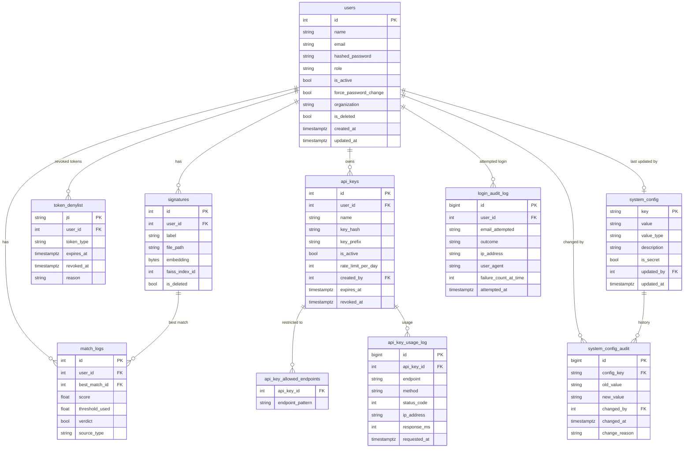

# Signature Verifier — Authentication, Authorization & UI Plan

**Document Version:** 1.0  
**Date:** 2026-03-19  
**Audience:** Business Analysts, Frontend Developers, Backend Developers  
**Status:** Draft for Review

---

## 1. Overview

This document describes the full design for the **user-facing interface**, **authentication system**, **role-based authorization**, **session management**, and **API key access** for the Signature Verifier platform.

The system currently exposes FastAPI endpoints for signature registration and verification. This plan extends it to include:

- A proper **Login and Registration UI** (Streamlit-based, migrating to a dedicated web frontend)
- A **JWT-based authentication system** with access and refresh tokens
- A **Role-Based Access Control (RBAC)** system with three tiers: Super Admin, Admin, General User
- A **Super Admin control panel** to manage users, system configuration, token policies, and audit logs
- An **API Key system** for programmatic/third-party integrations

This plan does **not** include ML model changes or FAISS index changes.

---

## 2. User Roles & Permissions Matrix

The system defines three roles. A new **Super Admin** role must be bootstrapped on first run.

| Capability | Super Admin | Admin (future) | General User |
|---|:---:|:---:|:---:|
| Register new system user accounts | ✅ | ❌ | ❌ |
| Suspend / restore any user account | ✅ | ❌ | ❌ |
| Manage all system configuration | ✅ | ❌ | ❌ |
| Set JWT token lifetime / refresh policy | ✅ | ❌ | ❌ |
| View all users and audit logs (global) | ✅ | ❌ | ❌ |
| Issue and revoke API keys | ✅ | ❌ | ❌ |
| Force-expire any user session | ✅ | ❌ | ❌ |
| Register a customer's signature | ✅ | ❌ | ✅ |
| Verify a customer's signature | ✅ | ❌ | ✅ |
| View own verification history | ✅ | ❌ | ✅ |
| Change own password | ✅ | ❌ | ✅ |

> **Note:** The "Admin" role is listed for future extensibility (e.g. a branch manager who can manage their own team) but is not in scope for the initial implementation.

---

## 3. Super Admin Bootstrap

Since no Super Admin exists yet, a one-time **bootstrap mechanism** is required.

### 3.1 Bootstrap Strategy

The Super Admin account is created via a **CLI seed script** (`scripts/bootstrap_superadmin.py`) that runs once during initial deployment. It:

1. Checks if any `role = "superadmin"` user exists in the database.
2. If none exists, prompts for email and password (or reads from environment variables `SUPERADMIN_EMAIL` and `SUPERADMIN_PASSWORD`).
3. Creates the Super Admin account with `is_active = True`, `role = "superadmin"`.
4. Exits immediately if a Super Admin already exists (idempotent and safe to re-run).

### 3.2 Super Admin Credentials in `.env`

```
SUPERADMIN_EMAIL=admin@yourdomain.com
SUPERADMIN_PASSWORD=<strong-password>
```

> **IMPORTANT:** These environment variables are only read during bootstrap. After the first run, they can be removed from `.env`. The password is stored only as a bcrypt hash in the database; the plaintext is never persisted.

---

## 4. Authentication System

### 4.1 Registration (General Users — created by Super Admin only)

General users **cannot self-register**. Only a Super Admin can create new user accounts. This prevents unauthorized access to the signature system.

**Registration Flow:**
1. Super Admin logs in and navigates to the **User Management** panel.
2. Super Admin fills in: Full Name, Email, Temporary Password, Organization.
3. Backend validates: email format, email uniqueness, password strength (min 10 chars, 1 uppercase, 1 digit, 1 special character).
4. User account is created with `is_active = True` and `role = "user"`.
5. On first login, the new user is **forced to change their temporary password** before accessing any feature.

**Validation Rules (Registration Form):**

| Field | Rule |
|---|---|
| Full Name | Required, 2–100 characters, letters only (no symbols) |
| Email | Required, valid email format, must not already exist |
| Password | Min 10 chars, ≥1 uppercase, ≥1 digit, ≥1 special character |
| Confirm Password | Must match Password |
| Organization | Optional, max 150 chars |

### 4.2 Login

All users (including Super Admin) authenticate via the standard login page.

**Login Flow:**
1. User submits email + password.
2. Backend verifies:
   - Email exists in the `users` table.
   - Account is not soft-deleted (`is_deleted = False`).
   - Account is active (`is_active = True`).
   - Password matches bcrypt hash (`hashed_password`).
3. On success: generates an **Access Token** + **Refresh Token** pair.
4. Returns both tokens to the client.
5. Client stores tokens securely (HTTP-only cookies preferred; localStorage is secondary and must not store the refresh token).

**Login Failure Handling:**

| Condition | Response |
|---|---|
| Email not found | `401 Unauthorized` — "Invalid credentials" (deliberately vague) |
| Wrong password | `401 Unauthorized` — "Invalid credentials" |
| Account suspended | `403 Forbidden` — "Your account has been suspended. Contact your administrator." |
| Account deleted | `401 Unauthorized` — "Invalid credentials" |
| Too many failed attempts | `429 Too Many Requests` — lockout after 5 consecutive failures |

### 4.3 Account Lockout Policy

- After **5 consecutive failed logins**, the account is **temporarily locked for 15 minutes**.
- Failed attempt counter resets on a successful login.
- A lockout is logged in the audit trail with the client IP address.
- Super Admin can **manually unlock** any account from the Admin panel.
- Lockout duration is configurable by Super Admin (see Section 7).

---

## 5. JWT Token Management

### 5.1 Token Types

| Token | Purpose | Default Lifetime | Storage |
|---|---|---|---|
| **Access Token** | Authorizes API calls | 60 minutes | HTTP-only cookie or Authorization header |
| **Refresh Token** | Obtains new Access Token without re-login | 7 days | HTTP-only cookie only (never in localStorage) |

Both tokens are signed using **HS256** (HMAC-SHA256) using the `SECRET_KEY` from `config.py`.

### 5.2 Access Token Payload (JWT Claims)

```json
{
  "sub": "42",
  "email": "user@example.com",
  "role": "user",
  "jti": "a3f9b1c2-...",
  "iat": 1710000000,
  "exp": 1710003600,
  "token_type": "access"
}
```

| Claim | Description |
|---|---|
| `sub` | User ID (integer as string) |
| `email` | User email address |
| `role` | `"superadmin"` or `"user"` |
| `jti` | Unique JWT ID (used for revocation) |
| `iat` | Issued-at timestamp |
| `exp` | Expiration timestamp |
| `token_type` | `"access"` or `"refresh"` |

### 5.3 Refresh Token Flow

1. Client sends a POST request to `/api/auth/refresh` with the Refresh Token (in cookie or body).
2. Backend validates the Refresh Token: signature, expiry, token type, not revoked.
3. If valid: issues a **new Access Token** and optionally rotates the Refresh Token (recommended for security).
4. If expired or revoked: responds with `401`; client must redirect to login.

### 5.4 Token Revocation

A **Token Denylist** table is maintained in PostgreSQL:

**Table: `token_denylist`**

| Column | Type | Description |
|---|---|---|
| `jti` | VARCHAR(36) PK | JWT ID from the token |
| `user_id` | INT FK | Owning user |
| `token_type` | VARCHAR(10) | `"access"` or `"refresh"` |
| `expires_at` | TIMESTAMP | When the token would naturally expire |
| `revoked_at` | TIMESTAMP | When it was explicitly revoked |
| `reason` | VARCHAR(100) | `"logout"`, `"admin_revoke"`, `"password_change"`, etc. |

Entries are automatically removed after `expires_at` by a scheduled cleanup job (nightly cron or APScheduler task).

### 5.5 Logout

- Client sends POST to `/api/auth/logout`.
- Backend adds the Access Token's `jti` **and** the Refresh Token's `jti` to the denylist.
- Client clears the stored cookies/tokens.

### 5.6 Session Behavior

| Event | Outcome |
|---|---|
| Access Token expired | Client uses Refresh Token to silently get new Access Token |
| Refresh Token expired | User must log in again |
| User changes password | All existing tokens for that user are immediately revoked |
| Super Admin suspends user | All existing tokens for that user are immediately revoked |
| Super Admin force-expires session | Target user's tokens added to denylist |

---

## 6. Super Admin Control Panel

The Super Admin gets a dedicated, protected section of the UI that general users cannot access.

### 6.1 User Management

- **List all users** with filters: role, status (active/suspended/deleted), organization, creation date.
- **Create new user account** (name, email, temporary password, organization).
- **Suspend / restore user** (sets `is_active = False/True` and immediately revokes all active tokens).
- **Soft-delete user** (marks `is_deleted = True`; the user cannot log in; their data is preserved).
- **Reset user password** (generates a new temporary password; user is forced to reset on next login).
- **View user's verification history** (all MatchLog entries for that user).
- **Force logout user** (adds all their current tokens to the denylist).

### 6.2 Token Policy Configuration

Super Admin can configure the following JWT parameters from the UI (stored in the `system_config` table, Section 7):

| Setting | Default | Description |
|---|---|---|
| Access Token Lifetime | 60 min | How long before the access token expires |
| Refresh Token Lifetime | 7 days | How long before the refresh token expires |
| Refresh Token Rotation | Enabled | Whether to issue a new refresh token on each use |
| Max Concurrent Sessions | Unlimited | Number of simultaneous active sessions per user |
| Lockout Threshold | 5 attempts | Failed login attempts before lockout |
| Lockout Duration | 15 min | How long the lockout lasts |

> **Note:** Changing the `SECRET_KEY` immediately invalidates **all** existing tokens system-wide (acts as a global logout). This must be considered a breaking change and surfaced clearly in the UI with a confirmation warning.

### 6.3 API Key Management

See Section 8.

### 6.4 System Configuration Panel

See Section 7.

### 6.5 Audit Log Viewer

- Global view of all `MatchLog` entries across all users.
- Filters: user, date range, verdict (MATCH / NO MATCH), source type (image/video).
- Exportable as CSV.
- **Login Audit Log:** a separate table (`login_audit_log`) capturing all login attempts, outcomes, IP addresses, and user agents.

---

## 7. System Configuration (Super Admin Only)

All system-level configuration that was previously hardcoded in `.env` should be manageable by the Super Admin from the UI **without requiring a server restart**. Configuration is stored in a `system_config` key-value table in PostgreSQL and read at runtime with a short in-memory cache (e.g., 60-second TTL).

**Table: `system_config`**

| Column | Type | Description |
|---|---|---|
| `key` | VARCHAR(100) PK | Configuration key name |
| `value` | TEXT | String-serialized value |
| `value_type` | VARCHAR(20) | `"int"`, `"float"`, `"bool"`, `"string"`, `"json"` |
| `description` | TEXT | Human-readable description for the UI |
| `updated_at` | TIMESTAMP | Last change timestamp |
| `updated_by` | INT FK | User ID of who changed it |

### 7.1 Configurable Parameters

| Config Key | Type | Default | Notes |
|---|---|---|---|
| `match_threshold` | float | 0.85 | Cosine similarity threshold for MATCH verdict |
| `max_file_size_mb` | int | 10 | Max upload size |
| `allowed_image_extensions` | json | `[".png",".jpg",...]` | Accepted formats |
| `access_token_expire_minutes` | int | 60 | JWT access token lifetime |
| `refresh_token_expire_days` | int | 7 | JWT refresh token lifetime |
| `refresh_token_rotation` | bool | true | Rotate refresh token on use |
| `max_login_attempts` | int | 5 | Before lockout |
| `lockout_duration_minutes` | int | 15 | Lockout period |
| `require_password_change_on_first_login` | bool | true | Force temp password reset |
| `api_key_enabled` | bool | true | Toggle API key access globally |
| `api_key_default_rate_limit` | int | 1000 | Requests per day per API key |

---

## 8. API Key System

The API Key system allows **external applications and third-party integrations** to access the signature verification API without using the JWT login flow.

### 8.1 Design Philosophy

- API keys are an **alternative authentication method**, not a replacement for JWT.
- Each API key is scoped to a **specific user account**.
- Rate limiting is enforced per API key.
- API keys never expire by default but can be revoked at any time by Super Admin.
- All API key usage is logged in the `api_key_usage_log` table.

### 8.2 API Key Format

```
sv_live_<40-character-random-hex>
```

Example: `sv_live_a3f8b29c1e04d76f5a12b890c3e4d5f6a7b890c1`

The key is generated server-side using a cryptographically secure random generator. The full key is shown **only once** to the Super Admin at creation time. After that, only a **SHA-256 hash** of the key is stored in the database — just like password hashing — so a database breach does not expose live keys.

### 8.3 API Key Table (`api_keys`)

| Column | Type | Description |
|---|---|---|
| `id` | INT PK | Auto-increment |
| `user_id` | INT FK | User this key belongs to |
| `name` | VARCHAR(100) | Human label, e.g. "ERP Integration Key" |
| `key_hash` | VARCHAR(64) | SHA-256 hash of the full key (never store plaintext) |
| `key_prefix` | VARCHAR(10) | First 10 chars of key for display (e.g., `sv_live_a3f`) |
| `is_active` | BOOLEAN | Whether the key is currently active |
| `rate_limit_per_day` | INT | Override per-key rate limit |
| `allowed_endpoints` | JSON | Optional endpoint whitelist, e.g. `["/api/signatures/verify"]` |
| `last_used_at` | TIMESTAMP | Last request timestamp |
| `created_at` | TIMESTAMP | Creation time |
| `expires_at` | TIMESTAMP NULL | Optional expiration (null = never expires) |
| `revoked_at` | TIMESTAMP NULL | Set when revoked |
| `description` | TEXT | Purpose / integration notes |

### 8.4 API Key Authentication Flow

1. Client includes key in request header: `X-API-Key: sv_live_<key>`
2. Backend extracts header, computes SHA-256 hash of provided value.
3. Looks up hash in `api_keys` table.
4. Validates: key exists, `is_active = True`, not expired, `allowed_endpoints` matches (if set).
5. Loads the associated user and injects their identity into the request context (same as JWT auth).
6. Proceeds to the endpoint handler with the user's role and permissions.
7. Logs the request to `api_key_usage_log`.

### 8.5 API Key Rate Limiting

- Tracked using a **sliding window counter** stored in-memory (or Redis if deployed at scale).
- Default: 1,000 requests/day per key (configurable globally and per-key).
- Exceeding limit returns `429 Too Many Requests` with a `Retry-After` header.

### 8.6 API Key Management (Super Admin Panel)

| Action | Description |
|---|---|
| Create API Key | Assign to a user, set name, optional rate limit and expiry |
| View all keys | Table with prefix, user, status, last used, rate limit |
| Revoke key | Sets `is_active = False` and records `revoked_at` |
| Rotate key | Revokes old key, generates and returns new key for same user/config |
| View key usage log | Per-key request history with timestamps and endpoints |

---

## 9. Frontend UI Design Plan

### 9.1 Page Structure

The UI is accessed via a browser. The current Streamlit prototype should be extended (or migrated to a lightweight React/HTML app) to support the following pages:

```
/login                    → Login page (all users)
/change-password          → Forced password change on first login
/dashboard                → General user home (after login)
  /dashboard/register     → Register a new customer signature
  /dashboard/verify       → Verify a signature
  /dashboard/history      → Own verification history
/admin                    → Super Admin panel (role-guarded)
  /admin/users            → User management (CRUD)
  /admin/config           → System configuration
  /admin/api-keys         → API key management
  /admin/audit            → Global audit log viewer
```

### 9.2 Login Page

**Fields:**
- Email address (with validation)
- Password (masked)
- "Remember me" (extends Refresh Token storage but not lifetime)

**Behaviors:**
- Show inline validation errors (not just server errors).
- After 3 failed attempts: show CAPTCHA challenge (optional, configurable).
- After 5 failed attempts: show lockout message with countdown timer.
- On success: redirect to `/dashboard` (or `/admin` for Super Admin).

### 9.3 Registration (Admin-Only Panel)

Accessible only from `/admin/users`. The Super Admin fills in:
- Full Name, Email, Temporary Password (auto-generated or manual), Organization.
- Role selection: currently only `"user"` is assignable.
- On submission: form validation → API call → success/error toast notification.

### 9.4 Dashboard (General User)

After login, the General User sees:

- **Summary stats:** total signatures registered, total verifications today, recent match results.
- **Quick actions:** Register Signature button, Verify Signature button.
- **Recent activity:** last 5 verification results with verdict badge (MATCH/NO MATCH) and score.

### 9.5 Super Admin Panel Sections

**User Management Tab:**
- Tabular list of all users with sortable columns.
- Action buttons per row: Suspend, Reset Password, View History, Delete.
- "Add User" button opening a modal form.

**System Configuration Tab:**
- Form with grouped settings (Auth, Upload, Model, API Keys).
- Changes are confirmed with a dialog ("Are you sure you want to change the MATCH threshold from 0.85 to 0.90?").
- Audit trail of configuration changes shown below the form.

**API Key Management Tab:**
- Table of all API keys (prefix, assigned user, status, rate limit, last used).
- "Create Key" modal.
- Per-key actions: View Usage, Rotate, Revoke.

**Audit Log Tab:**
- Searchable, filterable table of all MatchLog + login events.
- Date range picker, user filter, verdict filter.
- Export to CSV button.

---

## 10. Backend API Endpoints (New — Auth & Admin)

These endpoints need to be implemented in a new `routers/auth.py` and `routers/admin.py`.

### 10.1 Auth Endpoints

| Method | Path | Auth Required | Description |
|---|---|---|---|
| `POST` | `/api/auth/login` | None | Login with email+password; returns tokens |
| `POST` | `/api/auth/logout` | Access Token | Revoke current session tokens |
| `POST` | `/api/auth/refresh` | Refresh Token | Obtain new Access Token |
| `POST` | `/api/auth/change-password` | Access Token | Change own password |
| `GET` | `/api/auth/me` | Access Token | Get own profile information |

### 10.2 Admin Endpoints (Super Admin Only)

| Method | Path | Description |
|---|---|---|
| `GET` | `/api/admin/users` | List all users (paginated) |
| `POST` | `/api/admin/users` | Create a new user account |
| `GET` | `/api/admin/users/{id}` | Get a single user's profile |
| `PATCH` | `/api/admin/users/{id}/suspend` | Suspend a user account |
| `PATCH` | `/api/admin/users/{id}/restore` | Restore a suspended account |
| `DELETE` | `/api/admin/users/{id}` | Soft-delete a user account |
| `POST` | `/api/admin/users/{id}/reset-password` | Reset a user's password |
| `POST` | `/api/admin/users/{id}/force-logout` | Revoke all sessions for a user |
| `GET` | `/api/admin/config` | Get all system config values |
| `PUT` | `/api/admin/config` | Update system config values |
| `GET` | `/api/admin/api-keys` | List all API keys |
| `POST` | `/api/admin/api-keys` | Create a new API key |
| `PATCH` | `/api/admin/api-keys/{id}/revoke` | Revoke an API key |
| `POST` | `/api/admin/api-keys/{id}/rotate` | Rotate (replace) an API key |
| `GET` | `/api/admin/audit/matches` | Global match history log |
| `GET` | `/api/admin/audit/logins` | Login attempt audit log |

---

## 11. Database Schema — Full Normalized Design

All new tables live in the same PostgreSQL database (`signature_db`) alongside the existing `users`, `signatures`, and `match_logs` tables. They follow the same conventions: `TimestampMixin` for audit timestamps, `SoftDeleteMixin` only where row preservation is needed, and integer surrogate primary keys for all relational tables.

> **Normalization target:** Third Normal Form (3NF) throughout.  
> Every non-key attribute depends on the whole primary key and nothing but the primary key.  
> Where a repeating group or multi-value attribute appears (e.g. allowed endpoints per API key), it is extracted into its own child table.

---

### 11.1 Existing Table Changes

Only one non-breaking column addition is needed on the `users` table:

**`users` table — add one column:**

| Column | Type | Constraint | Default | Purpose |
|---|---|---|---|---|
| `force_password_change` | `BOOLEAN` | NOT NULL | `TRUE` | When `TRUE`, user is redirected to change-password page immediately after login. Set to `TRUE` by Super Admin when creating an account or resetting a password; set to `FALSE` after user completes the change. |

**Alembic migration:** `ALTER TABLE users ADD COLUMN force_password_change BOOLEAN NOT NULL DEFAULT TRUE;`

No other changes to existing tables are required. The existing `role VARCHAR(50)` column on `users` is used as-is (`"user"`, `"superadmin"`).

---

### 11.2 New Table: `token_denylist`

**Purpose:** Holds the JTI (JWT ID) of every explicitly revoked token so that the auth middleware can reject them even before their natural expiry. This is the mechanism behind logout, force-logout, and password-change invalidation.

**Normalization note:** This table is already in 3NF. `user_id` is denormalized here intentionally (it is in the JWT payload) to allow a fast `DELETE WHERE user_id = ?` when bulk-revoking all sessions for a suspended user, without joining back to tokens.

| Column | Type | Constraint | Description |
|---|---|---|---|
| `jti` | `VARCHAR(36)` | **PK**, NOT NULL | UUID v4 from the `jti` JWT claim. Surrogate PK — already unique by design. |
| `user_id` | `INTEGER` | FK → `users.id` ON DELETE CASCADE, NOT NULL | Owner of the revoked token. Allows bulk revocation per user. |
| `token_type` | `VARCHAR(10)` | NOT NULL, CHECK IN (`'access'`, `'refresh'`) | Distinguishes which token type was revoked. |
| `expires_at` | `TIMESTAMPTZ` | NOT NULL | Natural expiry of the token. Cleanup job deletes rows past this time. |
| `revoked_at` | `TIMESTAMPTZ` | NOT NULL, DEFAULT `NOW()` | When the revocation was recorded. |
| `reason` | `VARCHAR(50)` | NOT NULL | Enum-style reason: `logout`, `password_change`, `admin_revoke`, `rotation`. |

**Indexes:**

| Index | Columns | Type | Purpose |
|---|---|---|---|
| `pk_token_denylist` | `jti` | PK (B-tree) | Fast single-token lookup on every authenticated request |
| `ix_token_denylist_user_id` | `user_id` | B-tree | Fast bulk delete when user is suspended |
| `ix_token_denylist_expires_at` | `expires_at` | B-tree | Efficient cleanup job (`DELETE WHERE expires_at < NOW()`) |

---

### 11.3 New Table: `system_config`

**Purpose:** Key-value store for all Super Admin-controlled runtime configuration. Replaces hardcoded `.env` values for settings that need to change without a server restart.

**Normalization note:** A pure key-value table is intentionally "flat" by design. Splitting it further would add complexity with no benefit. The `updated_by` FK ensures traceability without duplicating user data. The change history is tracked in the separate `system_config_audit` table (11.4) to keep this table lean and fast to read.

| Column | Type | Constraint | Description |
|---|---|---|---|
| `key` | `VARCHAR(100)` | **PK**, NOT NULL | Unique config key, e.g. `match_threshold`. Snake_case convention. |
| `value` | `TEXT` | NOT NULL | Serialized value. All types stored as text; deserialized by `value_type`. |
| `value_type` | `VARCHAR(10)` | NOT NULL, CHECK IN (`'int'`, `'float'`, `'bool'`, `'string'`, `'json'`) | Tells the runtime how to cast `value` when reading. |
| `description` | `TEXT` | NOT NULL | Human-readable explanation displayed in the Admin UI. |
| `is_secret` | `BOOLEAN` | NOT NULL, DEFAULT `FALSE` | If `TRUE`, value is masked in the Admin UI and excluded from API responses. |
| `updated_at` | `TIMESTAMPTZ` | NOT NULL, DEFAULT `NOW()` | Last modified timestamp. |
| `updated_by` | `INTEGER` | FK → `users.id` ON DELETE SET NULL, NULLABLE | User ID of the Super Admin who last changed this value. |

**Indexes:**

| Index | Columns | Purpose |
|---|---|---|
| `pk_system_config` | `key` | PK — direct key lookup (primary access pattern) |

---

### 11.4 New Table: `system_config_audit`

**Purpose:** Immutable change history for every system configuration edit. Derived from `system_config` updates but stored separately to maintain a full, tamper-resistant log. This satisfies 3NF — it is wrong to store history as columns in `system_config` (that would be a repeating group).

| Column | Type | Constraint | Description |
|---|---|---|---|
| `id` | `BIGINT` | **PK**, AUTOINCREMENT | Surrogate key. |
| `config_key` | `VARCHAR(100)` | FK → `system_config.key` ON DELETE CASCADE, NOT NULL | Which config entry was changed. |
| `old_value` | `TEXT` | NULLABLE | Value before the change (`NULL` for first-time set). |
| `new_value` | `TEXT` | NOT NULL | Value after the change. |
| `changed_by` | `INTEGER` | FK → `users.id` ON DELETE SET NULL, NULLABLE | User who made the change. |
| `changed_at` | `TIMESTAMPTZ` | NOT NULL, DEFAULT `NOW()` | When the change occurred. |
| `change_reason` | `VARCHAR(255)` | NULLABLE | Optional free-text reason entered by admin in the UI. |

**Indexes:**

| Index | Columns | Purpose |
|---|---|---|
| `pk_system_config_audit` | `id` | PK |
| `ix_sca_config_key` | `config_key` | Fetch history for a specific key |
| `ix_sca_changed_at` | `changed_at` | Date-range filtering in audit log viewer |
| `ix_sca_changed_by` | `changed_by` | "What did this admin change?" query |

---

### 11.5 New Table: `api_keys`

**Purpose:** Stores registered API keys for programmatic access. The plaintext key is **never** stored — only its SHA-256 hash. The key prefix is stored for human-readable display.

**Normalization note:** `allowed_endpoints` is a repeating, multi-value attribute. Instead of storing it as a JSON column (which violates 1NF), it is extracted to a separate `api_key_allowed_endpoints` table (11.6). This makes per-endpoint queries and revocations trivially indexed.

| Column | Type | Constraint | Description |
|---|---|---|---|
| `id` | `INTEGER` | **PK**, AUTOINCREMENT | Surrogate primary key. |
| `user_id` | `INTEGER` | FK → `users.id` ON DELETE CASCADE, NOT NULL | The user account this key authenticates as. |
| `name` | `VARCHAR(100)` | NOT NULL | Human-readable label, e.g. `"ERP Integration Key"`. |
| `description` | `TEXT` | NULLABLE | Free-text notes about the integration purpose. |
| `key_hash` | `VARCHAR(64)` | UNIQUE, NOT NULL | Hex-encoded SHA-256 of the full API key. Used for lookup on every request. |
| `key_prefix` | `VARCHAR(14)` | NOT NULL | First 14 characters of the key for display, e.g. `sv_live_a3f8b2`. Never enough to reconstruct the key. |
| `is_active` | `BOOLEAN` | NOT NULL, DEFAULT `TRUE` | `FALSE` = revoked; `TRUE` = usable. |
| `rate_limit_per_day` | `INTEGER` | NULLABLE | Per-key override. If `NULL`, falls back to `system_config.api_key_default_rate_limit`. |
| `last_used_at` | `TIMESTAMPTZ` | NULLABLE | Updated on each successful request (best-effort, may lag under high concurrency). |
| `expires_at` | `TIMESTAMPTZ` | NULLABLE | Optional hard expiry date. `NULL` = never expires. |
| `revoked_at` | `TIMESTAMPTZ` | NULLABLE | Populated when `is_active` is set to `FALSE`. |
| `created_by` | `INTEGER` | FK → `users.id` ON DELETE SET NULL, NULLABLE | Super Admin who created this key. |
| `created_at` | `TIMESTAMPTZ` | NOT NULL, DEFAULT `NOW()` | Key creation timestamp. |

**Indexes:**

| Index | Columns | Type | Purpose |
|---|---|---|---|
| `pk_api_keys` | `id` | PK | — |
| `uq_api_keys_key_hash` | `key_hash` | UNIQUE B-tree | **Critical** — primary lookup on every API request (`WHERE key_hash = ?`) |
| `ix_api_keys_user_id` | `user_id` | B-tree | List all keys for a given user |
| `ix_api_keys_is_active` | `is_active` | Partial B-tree (`WHERE is_active = TRUE`) | Fast filter for active keys only |

---

### 11.6 New Table: `api_key_allowed_endpoints`

**Purpose:** Stores the optional endpoint whitelist per API key in a normalized child table. An API key with no rows here is considered unrestricted (all endpoints permitted).

**Normalization note:** This extracts the multi-valued `allowed_endpoints` attribute from `api_keys`, achieving 1NF. Each row is one endpoint pattern. The composite PK ensures uniqueness.

| Column | Type | Constraint | Description |
|---|---|---|---|
| `api_key_id` | `INTEGER` | FK → `api_keys.id` ON DELETE CASCADE, NOT NULL | Parent API key. |
| `endpoint_pattern` | `VARCHAR(200)` | NOT NULL | Exact path or prefix pattern, e.g. `/api/signatures/verify`. |

**Composite PK:** (`api_key_id`, `endpoint_pattern`)

**Indexes:**

| Index | Columns | Purpose |
|---|---|---|
| `pk_api_key_endpoints` | `(api_key_id, endpoint_pattern)` | Ensures no duplicate endpoint rules per key |
| `ix_ake_api_key_id` | `api_key_id` | Retrieve all allowed endpoints for a key |

---

### 11.7 New Table: `api_key_usage_log`

**Purpose:** Detailed per-request access log for all API key-authenticated calls. Used for rate limiting checks, abuse detection, and usage reporting in the Super Admin panel.

**Normalization note:** 3NF — all columns depend solely on `id`. `api_key_id` is a FK, not a denormalized copy, so there's no transitive dependency. `user_id` is not stored here because it can always be derived via `api_keys.user_id`; this avoids a potential update anomaly if a key is reassigned.

| Column | Type | Constraint | Description |
|---|---|---|---|
| `id` | `BIGINT` | **PK**, AUTOINCREMENT | Surrogate key. BIGINT because this is a high-volume log table. |
| `api_key_id` | `INTEGER` | FK → `api_keys.id` ON DELETE CASCADE, NOT NULL | Which API key made this request. |
| `endpoint` | `VARCHAR(200)` | NOT NULL | Exact path called, e.g. `/api/signatures/verify`. |
| `method` | `VARCHAR(10)` | NOT NULL | HTTP method: `GET`, `POST`, etc. |
| `status_code` | `SMALLINT` | NOT NULL | HTTP response status returned. |
| `ip_address` | `VARCHAR(45)` | NULLABLE | Client IP (IPv4 or IPv6, max 45 chars). |
| `request_id` | `VARCHAR(36)` | NULLABLE | Correlation ID from `X-Request-ID` header, for cross-log tracing. |
| `response_ms` | `INTEGER` | NULLABLE | Processing time in milliseconds. |
| `requested_at` | `TIMESTAMPTZ` | NOT NULL, DEFAULT `NOW()` | Request timestamp. |

**Indexes:**

| Index | Columns | Purpose |
|---|---|---|
| `pk_api_key_usage_log` | `id` | PK |
| `ix_akul_api_key_id_requested_at` | `(api_key_id, requested_at)` | Sliding window rate limit query: `COUNT(*) WHERE api_key_id = ? AND requested_at > NOW() - INTERVAL '1 day'` |
| `ix_akul_requested_at` | `requested_at` | Date-range filtering in usage reports |

> **Retention:** This table grows fast. A nightly cleanup job should delete rows older than 90 days (configurable via `system_config`).

---

### 11.8 New Table: `login_audit_log`

**Purpose:** Immutable record of every login attempt (successful and failed), including lockout events. Provides the security team and Super Admin with a full authentication audit trail.

**Normalization note:** `user_id` is nullable (a login attempt with an unknown email still gets logged, but there's no valid user to reference). `email_attempted` is stored separately from `user_id` to capture attempts against non-existent accounts — this avoids the need for a FK on a nullable field pointing at a non-existent row.

| Column | Type | Constraint | Description |
|---|---|---|---|
| `id` | `BIGINT` | **PK**, AUTOINCREMENT | Surrogate key. BIGINT for high-volume log. |
| `user_id` | `INTEGER` | FK → `users.id` ON DELETE SET NULL, NULLABLE | Matched user, if the email exists. `NULL` for unknown email attempts. |
| `email_attempted` | `VARCHAR(200)` | NOT NULL | Email submitted in the login form. Captures unknown email attempts. |
| `outcome` | `VARCHAR(20)` | NOT NULL, CHECK IN (`'success'`, `'wrong_password'`, `'unknown_email'`, `'suspended'`, `'locked_out'`) | Normalized result of the attempt. |
| `ip_address` | `VARCHAR(45)` | NULLABLE | Client IP address. |
| `user_agent` | `VARCHAR(500)` | NULLABLE | HTTP `User-Agent` string (truncated to 500 chars). |
| `failure_count_at_time` | `SMALLINT` | NULLABLE | Running consecutive failure count at the time of this attempt (for lockout analysis). |
| `attempted_at` | `TIMESTAMPTZ` | NOT NULL, DEFAULT `NOW()` | Timestamp of the attempt. |

**Indexes:**

| Index | Columns | Purpose |
|---|---|---|
| `pk_login_audit_log` | `id` | PK |
| `ix_lal_user_id` | `user_id` | All login attempts for a known user |
| `ix_lal_email_attempted` | `email_attempted` | Detect credential stuffing against a specific email |
| `ix_lal_ip_address` | `ip_address` | Detect brute-force attempts from a single IP |
| `ix_lal_attempted_at` | `attempted_at` | Date-range filtering and lockout window queries |
| `ix_lal_outcome` | `outcome` | Filter for failures/lockouts in audit viewer |

> **Retention:** Rows older than 180 days can be purged (configurable via `system_config`).

---

### 11.9 Entity Relationship Diagram

The diagram below shows all tables (existing and new) and their relationships.



---

### 11.10 Migration Summary

All changes are applied via Alembic in a single migration file. Order matters due to FK dependencies.

| Migration Step | Operation | Depends On |
|---|---|---|
| 1 | `ALTER TABLE users ADD COLUMN force_password_change` | — |
| 2 | `CREATE TABLE system_config` | `users` (FK `updated_by`) |
| 3 | `CREATE TABLE system_config_audit` | `system_config`, `users` |
| 4 | `CREATE TABLE token_denylist` | `users` |
| 5 | `CREATE TABLE api_keys` | `users` |
| 6 | `CREATE TABLE api_key_allowed_endpoints` | `api_keys` |
| 7 | `CREATE TABLE api_key_usage_log` | `api_keys` |
| 8 | `CREATE TABLE login_audit_log` | `users` |
| 9 | Seed `system_config` with default values | `system_config` |

---

## 12. Security Considerations

| Concern | Mitigation |
|---|---|
| Password storage | bcrypt with cost factor ≥ 12 |
| Token theft | Short-lived access tokens (60 min); refresh tokens in HTTP-only cookies |
| Refresh token reuse | Token rotation — old refresh token is revoked on each use |
| API key exposure | Never log or store plaintext key; display only at creation; store SHA-256 hash |
| Brute force | Account lockout after 5 failed attempts; rate limit on `/login` endpoint |
| CSRF | Use `SameSite=Strict` on cookies; CSRF token for state-changing admin actions |
| Privilege escalation | Role verified server-side on every request; never trust client-supplied role claims |
| Config changes | All admin config changes are logged with user ID and timestamp |
| SECRET_KEY rotation | Document that rotating the key revokes all sessions; provide a maintenance mode flag |

---

## 13. Implementation Phases

### Phase 1 — Foundation (Authentication)
- Super Admin bootstrap script
- Login, logout, refresh, change-password backend endpoints
- JWT access + refresh token issuance
- Token denylist table and middleware
- Login audit log table and logging
- Account lockout logic
- Login UI page + forced password change page

### Phase 2 — User Management (Super Admin)
- Admin panel UI skeleton with role-guard
- User CRUD endpoints
- Suspend/restore/force-logout functionality
- User management tab in admin panel

### Phase 3 — System Configuration
- `system_config` table + CRUD
- Runtime config cache with TTL
- Admin configuration tab UI

### Phase 4 — API Key System
- `api_keys` and `api_key_usage_log` tables
- API key generation, hashing, validation middleware
- Rate limiting per key
- API key management tab in admin panel

### Phase 5 — Audit & Polish
- Global audit log viewer
- Export to CSV
- Dashboard stats for general users
- UI refinements, error states, loading states

---

*End of Document*
